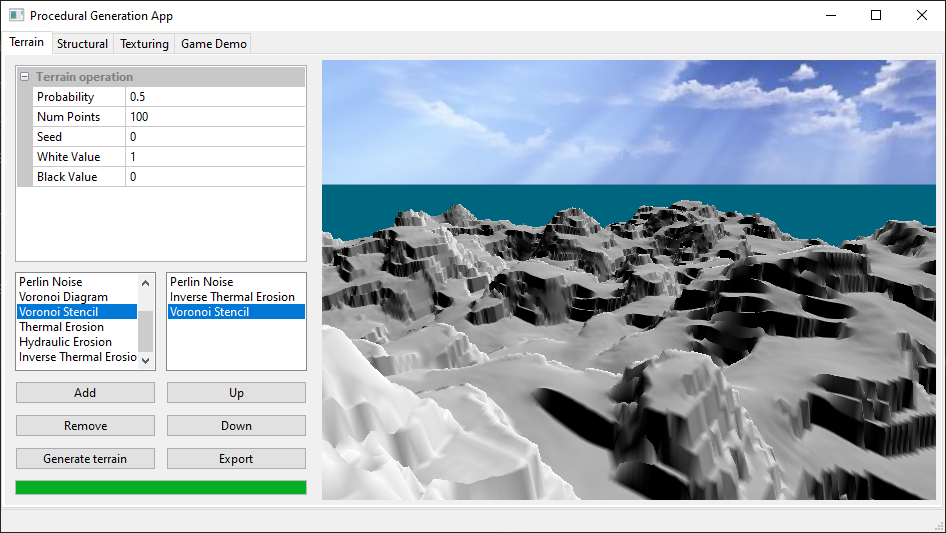

## Procedural Generation Application
An application developed for research into various different procedural generation techniques that can be applied in real time 3D games or applications. This includes techniques for procedurally generating terrain, building structures and textures/materials.

<table>
<tr>
<td></td>
<td></td>
<td></td>
</tr>
<tr>
<td></td>
<td></td>
<td></td>
</tr>
<tr>
<td></td>
<td></td>
<td></td>
</tr>
</table>

## Build instructions

- Install the latest version of Qt creator

- Install [vcpkg](https://vcpkg.io/en/) (preferably to the C:\vcpkg\ directory) and run the following command to install library dependencies:

 ```
vcpkg install glew
 ```

- Open the project file (.pro) in Qt creator
- If vcpkg is installed somewhere other that C:\vcpkg\ then you will need to update the paths assigned to 'LIBS' and 'INCLUDEPATH' in the .pro file to point to the correct vcpkg installation directory
- Build the project
- Copy the glew32.dll file from your C:\vcpkg\installed\x64-windows\bin\ directory into the 'build\Bin' directory
- Copy all the files in the 'Bin' directory (shaders, textures etc.) into the 'build\Bin' directory
- You should now be able to run the application from Qt creator


