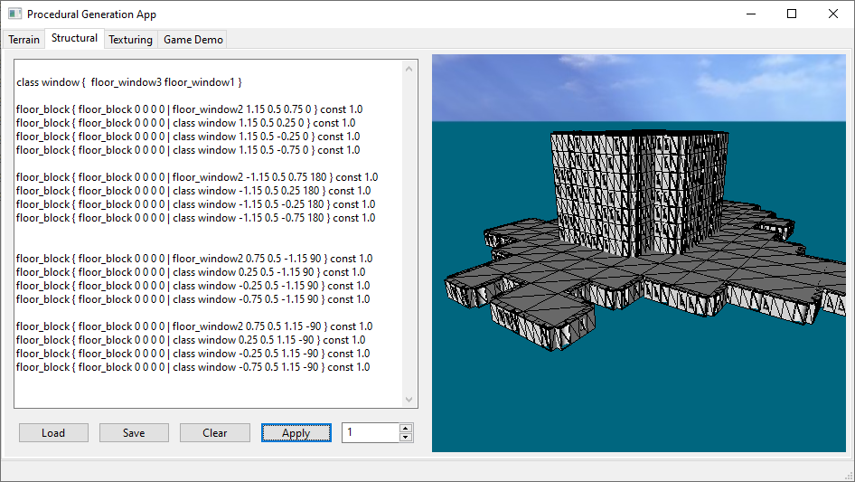

## Procedural Generation Application
An application developed for research into various different procedural generation techniques that can be applied in real time 3D games or applications. This includes techniques for procedurally generating terrain, building structures and textures/materials.

<table>
<tr>
<td></td>
<td></td>
<td></td>
</tr>
<tr>
<td></td>
<td></td>
<td></td>
</tr>
<tr>
<td></td>
<td></td>
<td></td>
</tr>
</table>

## Build instructions
Install [vcpkg](https://vcpkg.io/en/) and run the following command to install library dependencies:

```
vcpkg install wxwidgets opengl glew glm
```

 Then cd into the project root folder and run the following cmake commands:
```
cmake -B build -S . -DCMAKE_TOOLCHAIN_FILE=<path_to_vcpkg_dir>\scripts\buildsystems\vcpkg.cmake
```
```
 cmake --build build --config Release
```

Replacing the <path_to_vcpkg_dir> with the path to your vcpkg installation folder. This will place the executable and resource files into the /build/Release/ folder. You can build the Debug build by specifying --config Debug instead.


